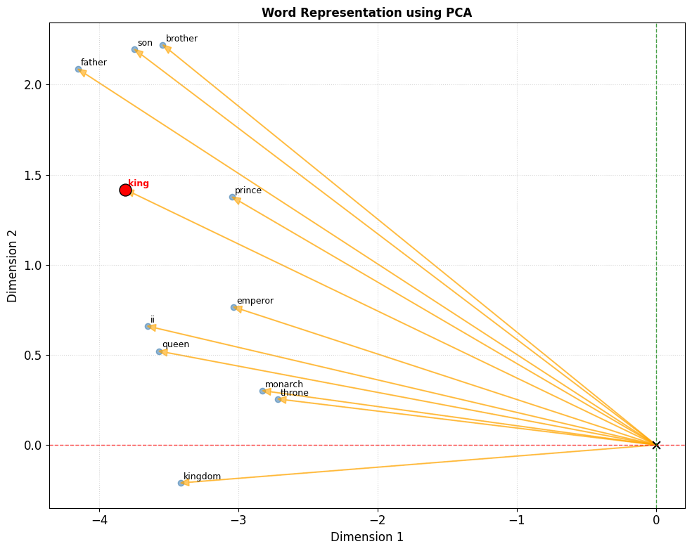

# Lab 3: Word Embeddings

## Phần 1: Trực quan hóa và phân tích embedding

### 1.  Dữ liệu, kết quả sử dụng

### 1.1. Dataset sử dụng

**Tên dataset**: GloVe Pre-trained Word Vectors

**Cấu trúc dữ liệu**:

- **Format**: Text file, mỗi dòng gồm: `word` + `vector values` (space-separated)
- **Số lượng**: 400,000 từ vựng
- **Kích thước vector**: 50d, 100d, 200d, 300d (sử dụng 100d)
- **Kiểu dữ liệu**: String (word) + Float values (vector)

### 2. Các bước thực hiện

1. Load pre-trained GloVe vectors bằng Gensim
2. Giảm chiều vector từ 100D xuống 2D bằng PCA
3. Trực quan hóa các từ trong không gian 2D bằng matplotlib
4. Tìm kiếm Top K từ tương đồng với một từ bất kỳ (ví dụ: "king")
5. Hiển thị kết quả và phân tích cụm từ, độ tương đồng

### 3. Hình ảnh trực quan hóa embedding

#### 3.1 PCA 2D từ GloVe

_Hình 1: Trực quan hóa PCA 2D của embedding GloVe_

#### 3.2 Word Representation using PCA

_Hình 2: Biểu diễn các từ bằng PCA, vector arrows từ gốc tọa độ_

### 4. Nhận xét về độ tương đồng và các từ đồng nghĩa

- Các từ đồng nghĩa/tương đồng tìm được từ model pre-trained GloVe rất hợp lý, ví dụ "computer" → computers, software, technology
- Độ tương đồng cosine cao cho thấy model học tốt các mối quan hệ ngữ nghĩa

### 5. Phân tích biểu đồ trực quan hóa

- Các từ liên quan được nhóm lại gần nhau, ví dụ cụm hoàng gia (king, queen, prince, kingdom)
- Một số cụm thú vị: công nghệ (computer, software, technology), địa lý (country, city, state)
- Giải thích: GloVe học từ thống kê đồng xuất hiện, PCA bảo toàn khoảng cách tương đối

### 7. So sánh model pre-trained và model tự huấn luyện

- Pre-trained GloVe có chất lượng tốt nhất do data lớn, similarity scores cao
- Model tự huấn luyện (Word2Vec) có vocabulary nhỏ hơn, chất lượng vừa phải nhưng vẫn học được các mối quan hệ cơ bản
- Spark MLlib training trên dataset lớn cho kết quả robust hơn, vocabulary lớn

### 8. Khó khăn và giải pháp

- Xử lý file GloVe lớn, cần đủ RAM
- Khác biệt format vector giữa Gensim và Spark, cần chuẩn hóa
- Đã giải quyết bằng cách subset, tối ưu plotting, dùng wrapper class cho embedding
